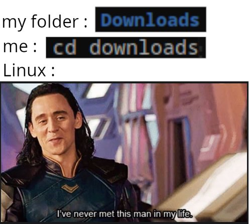

# [Getting Started with Linux](./Ubuntu_Server_CLI_pro_tips_2020-04.pdf)

## Terminal
- Get shit done without any bs!
- Type `exit` to exit the terminal ;)

## Shell
- Works between the terminal and OS's kernel (like an API to the kernel)
- Bourne Again Shell ( bash )
- powershell ( pwsh )
- zsh
- fish
- C Shell ( csh )

## Navigation

`List` items
```shell
ls
```
```shell
ls -al
```

## `print working directory`

```shell
pwd
```

### `Tip:` It's case-sensitive!



## `Change` Directory
```shell
cd Downloads
```

### Tip: use `TAB` to auto-complete!

## `Move` Directory
```shell
mv move_this_directory to_this_directory
```

## `Go back` one directory
```shell
cd ..
```

## Go `home`
```shell
cd
```

# Files & Directories `Management`

## `Create` a file
```shell
touch file_name.extension
```

## Create a `Directory`
```shell
mkdir directory_name
```

## print `file contents`
```shell
cat file_name.extension
```

## `Write & Save` to a new file
```shell
echo "Write something here" > file_name.extension
```  

## Write & Save to an `existing file`
```shell
echo "Write something here" >> file_name.extension
```  

## `Move` a file
```shell
mv this_file.extension to_this_directory/
```   

## Move a `Directory`
```shell
mv this_directory to_this_directory/
```   

## `Copy` a file's contents to another file
```shell
cp this_file.extension to_this_file.extension
```

## `Copy` a file's contents to another Directory's File
```shell
cp this_file.extension to_this_directory/then_to_this_file.extension
```

## `Remove` a file
```shell
rm file_name.extension
```

## `Remove` a Directory
```shell
rm -r directory_name
```

## `Remove Everything` from the current directory
- `Be careful` while using this one!
- Never run this command on `root` ( / ) or, it'll destroy the entire operating system!

```shell
rm -r *
```


# Nano
```shell
nano file_name.extension
```
- Edit file, if it's not found, it creates a new file
- Write & CTRL + O, to write out & press enter to confirm
- CTRL + X, exit nano...


# Vim
```shell
vim file_name.extension
```
- press `i` to insert & write...
- `ESC` to exit insert mode
- `:wq` to Write & Quit
- `:q` to Quit


# Network Management
- press `q` to quit or, `CTRL + C` to cancel.

## Network `Status`
```shell
networkctl status
```

## `Networks, IP & MAC` info...
- Requires `net-tools`
```shell
ifconfig
```
```shell
networkctl status
```
```shell
ip route
```

## # Firewall
- `ufw`

## Firewall `Manual Page`
```shell
sudo ufw list
```
## `Enable Firewall`
```shell
sudo ufw enable
```
## `Firewall Status`
```shell
sudo ufw status
```
## `Allow` permission to a port
```shell
sudo ufw allow port_number
```

# SSH

- Connect to a system/server through `ssh`
- Replace `192.168.0.103` with your `Server's IP`
```shell
ssh username@192.168.0.103
```

## Allow SSH's `port 22` to start listening for incoming connections 
- if you're using a firewall that is, `ufw`
```shell
sudo ufw allow 22
```

# Installing external packages: `APT`
- `Debian/Ubuntu` Systems

## `Search` for a package
```shell
sudo apt search package_name
```

## `Install` a package
```shell
sudo apt install package_name
```

## `Remove` a package
```shell
sudo apt remove package_name
```

## Remove `unnecessary/cached` packages
```shell
sudo apt autoremove
```

## Some useful `packages`
- htop
- bpytop
- neofetch
- screenfetch
- vim
- git
- espeak
- figlet
- curl 
- wget
- tree
- mlocate
- terminator
- vlc
- python3
- python3-pip
- python3-pyaudio
- postgresql
- nodejs
- net-tools
- ufw
- ssh
- tor
- proxychains
- wireshark
- gnome-clocks
- gnome-todo
- gnome-tweaks
- thunar
- dolphin
- libreoffice
- gimp
- android-tools-adb
- android-tools-fastboot
- sl ( Train Animation! )
- docker

# Installing from `snap`

## `Install` a package
- Use `--classic` if required...
```shell
sudo snap install package_name
```
```shell
sudo snap install package_name --classic
```

## `Remove` a package
```shell
sudo snap remove package_name
```

## Some useful `snap-packages`
- code  (VS Code)
- chromium
- spotify
- microk8s


# Installing a `.deb` package
- `Debian/Ubuntu` Systems

## Give a package `executable` permission
```shell
chmod +x package_name
```
## `Install` a package
```shell
sudo apt install ./package_name.deb
```

# Introduction to `pacman`
- `Arch` based systems
- `AUR` is also a good way to install packages on Arch Systems

## `Update & Upgrade` the system
```shell
sudo pacman -Syu
```

## `Install` a package
```shell
sudo pacman -Sy package_name
```
```shell
sudo pacman -S package_name
```

## `Remove` a package
```shell
sudo pacman -R package_name
```

## `Remove` a package along with its dependencies
```shell
sudo pacman -Rs package_name
```


# Installing through `DNF`
- `Fedora` based systems ( Red Hat, RHEL )
- Successor to `YUM`

## `Update & Upgrade` the system
```shell
sudo dnf update
```
```shell
sudo dnf upgrade
```

## `Search` a package
```shell
dnf search package_name
```
## `Install` a package
```shell
sudo dnf install package_name
```
## `Remove` a package
```shell
sudo dnf remove package_name
```
## Clear package cache
```shell
sudo dnf autoremove
```

# Installing a `.rpm` package
- `Fedora/RHEL` Systems

## Give a package `executable` permission
```shell
chmod +x package_name
```
## `Install` the package
```shell
sudo dnf install ./package_name.rpm
```


# System Management

## `Date & Time` of the system
```shell
date
```

## `Uptime` of the System
```shell
uptime
```

## `Reboot`
```shell
reboot
```
```shell
sudo reboot
```

## `Power Off / Shutdown`
```shell
poweroff
```
```shell
sudo poweroff
```

## Run previous command with `superuser`
```shell
sudo !!
```

## `Update` the system
```shell
sudo apt update
```

## `Upgrade` the system
```shell
sudo apt upgrade
```

## `Update & Upgrade` the system
- Use `-y` for auto-confirmation

```shell
sudo apt update ; sudo apt upgrade
```

```shell
sudo apt update ; sudo apt upgrade -y
```

# `Switch` to superuser


```shell
sudo su
```

## System `status`

- press `q` to quit

```shell
systemctl status
```

## `Time & Date` Status
```shell
timedatectl status
```

## `System` information
```shell
uname -a
```

# Disks

- Use `Disks` application for disk management   ( GUI )

```shell
df -h
```
```shell
lsblk
```

### `TIP:` Choose the disk's name carefully...!

## `Mount` a Disk
```shell
sudo mkdir /mnt/external
```
```shell
sudo mount /dev/sdX1 /mnt/external
```

## `Navigate` to the disk
```shell
cd /mnt/external
```

## `Unmount` the disk
```shell
umount /mnt/external
```

## `Auto-Mount` Functionality
- Replace `ext4` with your disk format like... `ntfs` `btrfs` `exfat` `fat32` in the following...
```shell
sudo vim /etc/fstab
```
## Write the follwing inside the file...
```shell
/dev/sdX1 /mnt/external ext4 defaults 0 0
```

# Additional Tips...
- Use `TAB` for auto-completion
- press `CTRL + C` to cancel an ongoing operation
- `CTRL + D` to quit
- `CTRL + SHIFT + C` to copy something from the terminal
- `CTRL + SHIFT + V` to paste something to the terminal

# Stuck, `Need Help?`
## Read the manual page of a command
```shell
man command
```
```shell
man apt
```
## List of Main Commands:
```shell
command --help
```

# Format the System
Fuck the system beyond recovery unless, you're running `virtualbox` ;)

- `Destroys` the entire Operating System!
```shell
sudo rm -rf /*

```


Don't be, you'll get used to it...

Take Care...

;)


##
##
##

# Introduction to PowerShell: `winget`
- `Windows` Systems

## Search a package
```shell
winget search package_name
```
```shell
winget search vscode
```

## Install a package
```shell
winget install author.package_name
```
```shell
winget install Microsoft.VisualStudioCode
```

### `Tip:` Smallcase works too...
```shell
winget install microsoft.visualstudiocode
```
